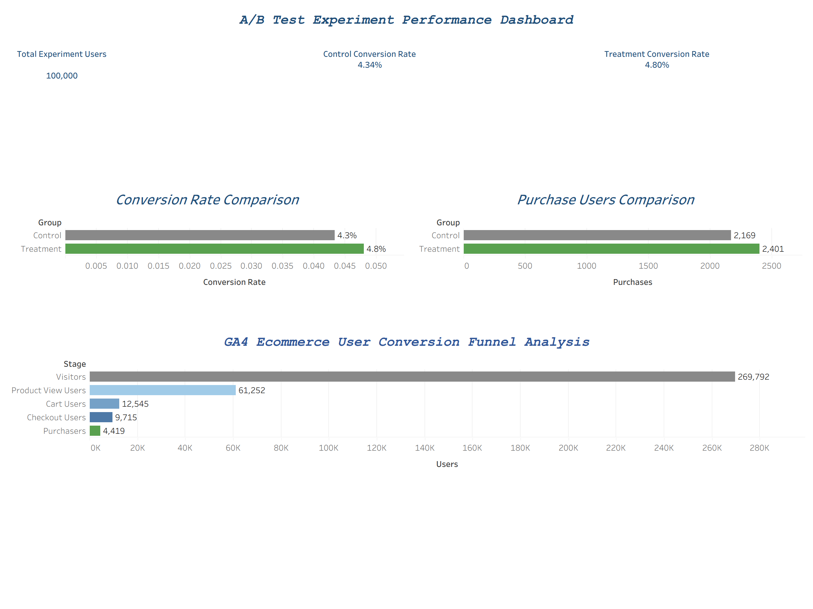

# 📊 A/B Test 实验效果分析与用户转化优化 Dashboard

<div align="center">

### 基于 GA4 电商行为数据、Python 统计检验与 Tableau 的用户增长分析项目

`Python` `Pandas` `NumPy` `SciPy` `SQL` `BigQuery` `Tableau` `A/B Testing`

</div>

---

# 📖 项目简介

本项目围绕电商平台的**用户增长与转化优化问题**展开，通过用户行为漏斗分析与 A/B Test 实验评估，研究新版本是否能够改善用户购买转化表现。

项目主要由两个部分组成：

1. **基于 Google Analytics 4（GA4）电商事件数据进行用户转化漏斗分析**
2. **通过模拟 A/B Test 实验数据完成实验设计、统计显著性检验和业务决策分析**

主要分析目标：

- 📈 新版本是否能够提升用户购买转化率（Conversion Rate）
- 🛒 Treatment 是否能够带来更多购买用户
- 🔍 用户在哪些转化环节发生明显流失
- 🧪 Treatment 与 Control 的差异是否具有统计显著性
- 💡 是否具备进一步推广 Treatment 版本的条件
- 🚀 下一轮产品和增长实验应该优先优化哪些环节

项目最终使用 **BigQuery + SQL + Python + Tableau** 完成从数据提取、指标计算、统计检验到 Dashboard 可视化及业务建议输出的完整分析流程。

---

# 🖼 Dashboard Preview



---

# 一、项目背景与实验设计 🧪

## 1.1 业务背景

某电商平台希望通过产品页面及用户体验优化，提高用户最终完成购买的概率。

因此，本项目设计了一个典型的产品 A/B Test 场景：

| 实验组 | 含义 |
|---|---|
| Control Group | 原始版本 |
| Treatment Group | 新版本 |

核心业务问题：

> **Treatment 版本是否能够显著提高用户购买转化率，并带来真实业务增长？**

---

## 1.2 数据来源说明

本项目的数据分为两个部分。

### ① GA4 电商用户行为数据

用户转化漏斗部分基于 Google 提供的 GA4 Ecommerce Sample Dataset。

主要用于分析：

```text
Visitors
   ↓
Product View
   ↓
Add to Cart
   ↓
Checkout
   ↓
Purchase
```

通过真实事件结构识别用户在不同购买阶段的转化与流失情况。

### ② A/B Test 实验数据

由于公开 GA4 数据本身并不是一个预先设计好的随机对照实验，因此本项目额外构建了**模拟 A/B Test 数据集**，用于完整演示：

- Control / Treatment 随机分组
- Conversion Rate 计算
- 样本量分析
- 假设检验
- 统计显著性判断
- 实验上线决策

> ⚠️ 因此，本项目中的漏斗分析基于 GA4 电商行为数据，而 A/B Test 部分属于模拟实验，用于展示标准产品实验分析流程。

这种设计避免将普通观察数据错误解释为随机实验数据。

---

# 二、实验指标体系 📐

## 2.1 核心指标

实验主要关注以下指标：

| 指标 | 含义 |
|---|---|
| Users | 实验用户数量 |
| Purchases | 完成购买的用户数量 |
| Conversion Rate | 购买用户数 / 实验用户数 |
| Absolute Lift | Treatment 与 Control 的转化率差值 |
| Relative Lift | Treatment 相对 Control 的转化提升比例 |
| p-value | 判断实验差异是否可能由随机波动造成 |
| Statistical Significance | 判断实验结果是否达到统计显著 |

---

## 2.2 实验规模

总实验用户：

**100,000**

两组用户分布：

| Group | Users |
|---|---:|
| Control | 50,000 |
| Treatment | 50,000 |
| **Total** | **100,000** |

两组样本规模一致，有利于实验结果比较。

---

# 三、用户转化漏斗分析 🔍

## 3.1 用户行为路径

本项目基于 GA4 Ecommerce Events 构建以下用户转化路径：

```text
Visitors
   ↓
Product View
   ↓
Cart
   ↓
Checkout
   ↓
Purchase
```

---

## 3.2 漏斗用户规模

| 阶段 | 用户数量 |
|---|---:|
| Visitors | 269,792 |
| Product View Users | 61,252 |
| Cart Users | 12,545 |
| Checkout Users | 9,715 |
| Purchasers | 4,419 |

---

## 3.3 最大流失环节

最明显的用户流失发生在：

```text
Visitors
269,792
   ↓
Product View
61,252
```

也就是说，大量访问用户并没有继续进入商品浏览阶段。

这一现象说明：

> **当前最大的增长空间并不只存在于最终支付环节，而是在漏斗顶部。**

---

## 3.4 Visitors → Product View 可能存在的问题

可能原因包括：

- Landing Page 与广告内容匹配度不足
- 首页首屏吸引力较弱
- 商品推荐不符合用户兴趣
- 用户无法快速发现目标商品
- 部分流量质量较低
- 页面加载速度或用户体验存在问题

### 优化方向

- ✅ 优化 Landing Page
- ✅ 调整首页商品展示
- ✅ 提升个性化推荐能力
- ✅ 按流量渠道拆分转化表现
- ✅ 对首页布局继续进行 A/B Test

---

## 3.5 Product View → Cart

商品浏览用户进一步进入购物车的比例仍存在较大提升空间。

可能影响因素：

- 商品价格
- 商品图片
- 商品详情描述
- 用户评价
- 优惠力度
- 运费
- 商品可信度

建议进一步测试：

- 商品主图
- CTA 按钮
- 优惠信息
- 用户评价模块
- 推荐商品模块

---

## 3.6 Cart → Checkout

用户进入购物车后，购买意图已经相对明确。

该阶段可以重点分析：

- 运费展示
- 优惠券使用流程
- 登录要求
- 地址填写流程
- Checkout 页面复杂度

---

## 3.7 Checkout → Purchase

Checkout 后仍有部分用户没有完成最终支付。

可能原因：

- 支付失败
- 支付方式不足
- 最终价格变化
- 优惠失效
- 临时放弃购买

未来可以结合支付失败和订单取消数据进一步分析。

---

# 四、A/B Test 实验结果 📊

## 4.1 Conversion Rate 对比

实验结果：

| Group | Users | Purchases | Conversion Rate |
|---|---:|---:|---:|
| Control | 50,000 | 2,169 | 4.338% |
| Treatment | 50,000 | 2,401 | 4.802% |

Dashboard 中以两位小数显示：

```text
Control CVR   = 4.34%
Treatment CVR = 4.80%
```

---

## 4.2 Absolute Lift

绝对转化率提升：

```text
4.802% - 4.338%
= 0.464 percentage points
```

即：

> **Treatment 的购买转化率提升约 0.46 个百分点。**

---

## 4.3 Relative Lift

相对提升：

```text
(4.802% - 4.338%) / 4.338%
≈ 10.7%
```

因此：

> 📈 **Treatment 相比 Control 实现约 10.7% 的相对转化提升。**

---

# 五、Purchase Users 对比 🛒

购买用户数量：

| Group | Purchasers |
|---|---:|
| Control | 2,169 |
| Treatment | 2,401 |

Treatment 相比 Control：

```text
2,401 - 2,169
= +232
```

即：

> **Treatment 组多产生 232 名购买用户。**

这说明 Treatment 带来的提升不仅体现在转化率比例上，也体现在实际购买用户规模上。

如果该提升能够在更大流量范围内稳定保持，则可能进一步转化为：

- 更多订单
- 更高 GMV
- 更高用户价值

---

# 六、统计显著性检验 🧪

仅观察：

```text
4.34% → 4.80%
```

并不能直接证明新版本一定有效。

转化率差异也可能来自随机波动。

因此，本项目进一步使用 Python 对实验结果进行统计显著性检验。

---

## 6.1 假设设定

### Null Hypothesis（H₀）

> Control 与 Treatment 的真实转化率不存在显著差异。

### Alternative Hypothesis（H₁）

> Treatment 与 Control 的真实转化率存在显著差异。

显著性水平设定：

```text
α = 0.05
```

---

## 6.2 Chi-square Test

Python 统计检验结果：

```text
Chi-square = 12.2355
p-value    = 0.000469
```

---

## 6.3 显著性判断

因为：

```text
p-value = 0.000469
```

并且：

```text
0.000469 < 0.05
```

因此：

> **拒绝零假设 H₀。**

说明 Control 与 Treatment 的购买转化表现之间存在统计显著差异。

换句话说：

> Treatment 转化率提升仅由随机波动造成的可能性较低。

因此，本实验结果：

### ✅ Statistically Significant

---

# 七、实验综合结论 💡

综合业务指标与统计检验结果：

| 指标 | Control | Treatment | 结论 |
|---|---:|---:|---|
| Users | 50,000 | 50,000 | 样本规模一致 |
| Purchases | 2,169 | 2,401 | Treatment +232 |
| Conversion Rate | 4.338% | 4.802% | Treatment 更高 |
| Absolute Lift | - | +0.464pp | 正向提升 |
| Relative Lift | - | +10.7% | 明显改善 |
| p-value | - | 0.000469 | `< 0.05` |
| Statistical Significance | - | Yes | 差异显著 |

最终可以得出：

> **Treatment 版本在购买转化率和购买用户数量方面均优于 Control，并且实验差异达到统计显著水平。**

因此，本次模拟实验支持：

### ✅ Treatment 方案具备进一步推广价值。

---

# 八、业务洞察 📌

## Insight 1：Treatment 有效改善用户转化

Control：

```text
4.338%
```

Treatment：

```text
4.802%
```

相对提升：

```text
+10.7%
```

说明新的产品体验能够增加用户最终完成购买的概率。

---

## Insight 2：实验提升能够转化为真实购买人数增长

Treatment 比 Control：

```text
+232 Purchasers
```

这意味着实验效果不仅停留在比例变化上，还带来了实际用户行为改善。

---

## Insight 3：最大的业务机会仍然位于漏斗顶部

虽然 Treatment 改善了最终购买转化，但 GA4 Funnel 显示：

```text
Visitors → Product View
```

仍然是最大的用户流失阶段。

因此：

> 单纯优化购买环节并不能解决全部增长问题。

下一阶段更值得投入资源的是：

- 流量质量
- Landing Page
- 商品发现
- 推荐系统
- 首页体验

---

## Insight 4：增长优化应该同时关注“漏斗效率”和“实验效果”

完整的增长分析不能只回答：

> 新版本有没有提升？

还需要回答：

> 哪个阶段最值得继续优化？

因此，本项目将：

```text
Funnel Analysis
+
A/B Testing
```

结合起来。

形成：

```text
发现问题
   ↓
提出假设
   ↓
设计实验
   ↓
统计检验
   ↓
业务决策
```

这也是数据驱动产品优化的完整流程。

---

# 九、上线策略建议 🚀

虽然 Treatment 实验结果统计显著，但真实业务环境中仍不建议直接 100% 全量上线。

建议采用：

```text
A/B Test
   ↓
10% Traffic
   ↓
30% Traffic
   ↓
50% Traffic
   ↓
100% Rollout
```

即采用 **Gradual Rollout / 灰度发布**。

每个阶段持续监控：

- Conversion Rate
- Purchasers
- GMV
- Average Order Value
- Refund Rate
- Retention Rate
- Page Performance

如果指标保持稳定，再逐步扩大覆盖范围。

---

# 十、后续 A/B Test 建议 🔬

## 10.1 Landing Page 优化

由于最大流失发生于：

```text
Visitors → Product View
```

建议优先测试：

- 首页首屏布局
- Banner
- 商品推荐
- CTA 按钮
- 商品排序方式

---

## 10.2 Product Detail Page

测试：

- 商品主图
- 商品描述
- 用户评价
- 优惠信息
- 推荐模块
- CTA 按钮

---

## 10.3 Checkout Optimization

测试：

- Checkout 步骤数量
- Guest Checkout
- 支付方式
- 运费展示方式
- 优惠券入口
- 默认支付方式

---

## 10.4 用户分群实验

未来可以按照：

- 新用户 vs 老用户
- 不同国家/地区
- 不同设备
- 不同流量渠道
- 不同用户价值层级

进一步分析 Treatment 是否对不同群体产生异质性效果。

---

# 十一、Dashboard 设计 📊

Tableau Dashboard 包含以下六个主要组件。

## KPI Cards

- Total Experiment Users
- Control Conversion Rate
- Treatment Conversion Rate

## Experiment Analysis

- Conversion Rate Comparison
- Purchase Users Comparison

## User Behavior Analysis

- User Conversion Funnel

Dashboard：


---

# 十二、项目技术栈 🛠

## 数据获取与查询

- Google BigQuery
- SQL
- GA4 Ecommerce Events

## 数据分析

- Python
- Pandas
- NumPy

## 统计分析

- SciPy
- Chi-square Test
- Hypothesis Testing
- Statistical Significance

## 数据可视化

- Tableau

## 分析方法

- Conversion Funnel Analysis
- A/B Testing
- Conversion Rate Analysis
- Hypothesis Testing
- KPI Analysis
- User Growth Analysis

---

# 十三、项目能力展示 🎯

通过该项目展示以下数据分析能力：

### SQL

✔ GA4 Event 数据提取  
✔ CASE WHEN  
✔ CTE  
✔ 用户行为指标计算  
✔ Funnel 数据构建  

### Python

✔ Pandas 数据处理  
✔ NumPy 数值计算  
✔ A/B Test 数据分析  
✔ Statistical Test  

### Statistics

✔ 实验假设设计  
✔ Conversion Rate  
✔ Relative Lift  
✔ Chi-square Test  
✔ p-value  
✔ Statistical Significance  

### Tableau

✔ KPI Card  
✔ Conversion Comparison  
✔ Funnel Visualization  
✔ A/B Test Dashboard  

### Business Analytics

✔ 用户增长分析  
✔ 转化漏斗诊断  
✔ 实验效果评估  
✔ 产品优化建议  
✔ 数据驱动业务决策  

---

# 十四、项目局限性 ⚠️

为了保证项目结论的严谨性，需要说明以下限制：

### 1. A/B Test 数据为模拟实验数据

本项目的 A/B Test 数据用于展示标准实验分析方法，并不是来自真实线上随机实验。

因此实验结论主要用于验证分析方法和业务决策流程。

### 2. GA4 Funnel 与 A/B Test 并非同一随机实验

GA4 数据用于分析用户行为路径，而模拟实验用于完成 Control / Treatment 实验分析。

两部分承担不同分析目的，不应直接视为同一批实验用户。

### 3. 当前实验主要关注 Conversion Rate

真实企业上线决策还应同时考虑：

- GMV
- Average Order Value
- Revenue
- Refund Rate
- Retention Rate
- Customer Lifetime Value

---

# 十五、最终项目结论 🏆

本项目完整构建了：

```text
用户行为数据
     ↓
Conversion Funnel
     ↓
发现业务流失问题
     ↓
提出产品优化假设
     ↓
设计 A/B Test
     ↓
统计显著性检验
     ↓
Tableau Dashboard
     ↓
业务上线建议
```

实验结果显示：

> 📈 Treatment Conversion Rate 从 **4.338% 提升到 4.802%**

> 🚀 Relative Conversion Lift 达到约 **10.7%**

> 🛒 Treatment 比 Control 多产生 **232 名购买用户**

> 🧪 p-value = **0.000469 < 0.05**

因此：

### ✅ Treatment 相比 Control 的提升具有统计显著性。

结合 Funnel Analysis 可以进一步发现：

> 当前最大的用户增长机会仍然存在于 **Visitors → Product View** 阶段。

因此，本项目最终建议：

> **在统计显著性支持下，可以采用灰度发布策略逐步扩大 Treatment 版本覆盖范围，同时继续针对 Landing Page、商品详情页和 Checkout 流程开展新一轮 A/B Test。**

---

# 📌 项目总结

本项目不仅关注：

> **“Treatment 是否优于 Control？”**

还进一步回答：

> **“用户为什么流失？”**

以及：

> **“下一步应该优化什么？”**

从而形成：

**数据分析 → 实验验证 → 产品决策 → 增长优化**

的完整业务分析闭环。

该项目主要展示了一个数据分析师在产品增长场景中的核心工作方式：

> **通过数据发现问题，通过实验验证假设，通过统计分析支持业务决策。**

---

<div align="center">

### 📊 User Growth × A/B Testing × Business Analytics

**Hongyang Song**

Data Analyst Portfolio

⭐ 如果这个项目对你有帮助，欢迎 Star！

</div>
